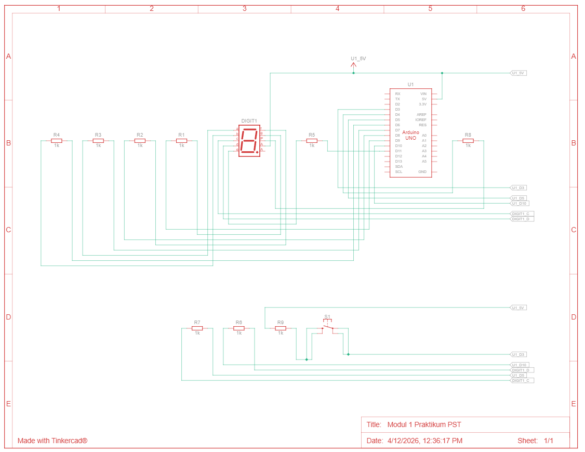

# Praktikum 2B: Kontrol Counter dengan Push Button

## Jawaban Pertanyaan Praktikum (2.6.4)

---

### 1. Schematic Rangkaian



Keterangan:
- Seven segment dihubungkan sama seperti pada percobaan 2A.
- Push button menggunakan pin 3 dengan konfigurasi INPUT_PULLUP, sehingga tidak memerlukan resistor pull-up eksternal.
- Salah satu kaki push button terhubung ke Pin 3 Arduino, kaki lainnya ke GND.

---

### 2. Mengapa Push Button Menggunakan Mode INPUT_PULLUP?

Pada kode:

```cpp
pinMode(btnUp, INPUT_PULLUP);
```

**Penjelasan INPUT_PULLUP:**

Ketika sebuah pin dikonfigurasi sebagai `INPUT` biasa tanpa pull-up atau pull-down eksternal, kondisi pin tersebut saat tombol tidak ditekan menjadi "mengambang" (floating). Pin dalam kondisi floating dapat membaca nilai yang tidak stabil, berganti-ganti antara HIGH dan LOW secara acak karena pengaruh noise dari lingkungan sekitar. Hal ini dapat menyebabkan program mendeteksi penekanan tombol palsu yang tidak pernah terjadi.

Mode `INPUT_PULLUP` mengaktifkan resistor pull-up internal yang sudah ada di dalam chip ATmega pada Arduino. Resistor ini menarik tegangan pin ke HIGH (5V) secara default ketika tombol tidak ditekan. Ketika tombol ditekan dan menghubungkan pin ke GND, pin membaca LOW.

**Keuntungan INPUT_PULLUP dibandingkan rangkaian biasa:**

1. Tidak memerlukan resistor eksternal tambahan, sehingga rangkaian lebih sederhana dan hemat komponen.
2. Pin selalu memiliki nilai yang pasti (HIGH saat tidak ditekan, LOW saat ditekan), tidak pernah floating.
3. Mengurangi kemungkinan pembacaan palsu akibat noise.
4. Kabel jumper yang lebih sedikit membuat rangkaian lebih rapi dan mudah di-debug.

Konsekuensinya, logika pembacaan menjadi terbalik dibanding intuisi umum: tombol tidak ditekan = HIGH, tombol ditekan = LOW. Ini sudah diakomodasi dalam kode dengan deteksi tepi turun (falling edge):

```cpp
if(lastUpState == HIGH && upState == LOW){ ... }
```

---

### 3. Jika Salah Satu LED Segmen Tidak Menyala, Apa Kemungkinan Penyebabnya?

**Dari sisi hardware:**

1. Kabel jumper longgar atau tidak terpasang dengan benar pada breadboard atau pin Arduino yang sesuai.
2. Resistor 220 Ohm putus atau nilainya salah (misal terlalu besar sehingga arus terlalu kecil).
3. LED segmen pada seven segment sudah rusak (terbakar atau mati).
4. Kabel terpasang pada baris breadboard yang berbeda sehingga tidak terhubung secara elektrik.
5. Seven segment mengalami korsleting pada jalur tertentu.
6. Pin Arduino yang digunakan mengalami kerusakan fisik dan tidak dapat mengeluarkan sinyal.

**Dari sisi software:**

1. Nomor pin yang didefinisikan dalam array `segmentPins` tidak sesuai dengan koneksi fisik pada rangkaian.

   ```cpp
   const int segmentPins[8] = {7, 6, 5, 11, 10, 8, 9, 4};
   // Jika koneksi fisik berbeda dengan urutan di sini,
   // segmen yang dituju tidak akan menyala dengan benar.
   ```

2. Pola bit dalam array `digitPattern` salah pada kolom segmen tertentu, sehingga segmen yang seharusnya menyala selalu mendapat nilai 0.

3. Fungsi `pinMode` tidak dipanggil untuk pin segmen tersebut, sehingga pin tidak dikonfigurasi sebagai OUTPUT dan tidak bisa mengontrol LED.

4. Terdapat kesalahan logika pada operator `!` di fungsi `displayDigit`. Jika operator ini dihapus, semua segmen yang seharusnya menyala justru akan mati dan sebaliknya.

---

### 4. Modifikasi: Dua Push Button untuk Increment dan Decrement

Berikut adalah modifikasi program menggunakan dua push button, satu untuk menaikkan nilai (increment) dan satu untuk menurunkan nilai (decrement), beserta penjelasan setiap baris kode:

**Perubahan rangkaian:**
- Push button increment: Pin 2 Arduino -> GND
- Push button decrement: Pin 3 Arduino -> GND
- Kedua tombol menggunakan INPUT_PULLUP, tidak perlu resistor eksternal.

```cpp
#include <Arduino.h>
// Menyertakan library Arduino agar fungsi pinMode, digitalWrite,
// digitalRead, dan delay dapat digunakan.

// Mendefinisikan pin Arduino yang terhubung ke setiap segmen seven segment.
// Urutan array: a, b, c, d, e, f, g, dp
const int segmentPins[8] = {7, 6, 5, 11, 10, 8, 9, 4};

// Mendefinisikan pin push button.
// btnUp  : tombol untuk menaikkan counter (increment), terhubung ke Pin 2.
// btnDown: tombol untuk menurunkan counter (decrement), terhubung ke Pin 3.
const int btnUp   = 2;
const int btnDown = 3;

// Pola bit untuk setiap karakter hex 0-F.
// Setiap baris mewakili satu karakter, urutan kolom: a b c d e f g dp
// Nilai 1 = segmen aktif (menyala), 0 = segmen tidak aktif (mati).
byte digitPattern[16][8] = {
  {1,1,1,1,1,1,0,0},  // 0
  {0,1,1,0,0,0,0,0},  // 1
  {1,1,0,1,1,0,1,0},  // 2
  {1,1,1,1,0,0,1,0},  // 3
  {0,1,1,0,0,1,1,0},  // 4
  {1,0,1,1,0,1,1,0},  // 5
  {1,0,1,1,1,1,1,0},  // 6
  {1,1,1,0,0,0,0,0},  // 7
  {1,1,1,1,1,1,1,0},  // 8
  {1,1,1,1,0,1,1,0},  // 9
  {1,1,1,0,1,1,1,0},  // A
  {0,0,1,1,1,1,1,0},  // b
  {1,0,0,1,1,1,0,0},  // C
  {0,1,1,1,1,0,1,0},  // d
  {1,0,0,1,1,1,1,0},  // E
  {1,0,0,0,1,1,1,0}   // F
};

// Variabel untuk menyimpan digit yang sedang ditampilkan.
// Dimulai dari 0.
int currentDigit = 0;

// Variabel untuk menyimpan state tombol pada iterasi sebelumnya.
// Digunakan untuk mendeteksi peristiwa tepi (edge detection).
// Nilai awal HIGH karena INPUT_PULLUP membuat tombol tidak ditekan = HIGH.
bool lastUpState   = HIGH;
bool lastDownState = HIGH;

// Fungsi untuk menampilkan satu karakter pada seven segment.
// Parameter num adalah indeks karakter (0-15) yang ingin ditampilkan.
void displayDigit(int num){
  for(int i=0; i<8; i++){
    // Operator ! membalik nilai karena tipe Common Anode:
    // nilai 1 (menyala) di array -> dikirim LOW ke pin Arduino -> segmen menyala.
    // nilai 0 (mati) di array   -> dikirim HIGH ke pin Arduino -> segmen mati.
    digitalWrite(segmentPins[i], !digitPattern[num][i]);
  }
}

// Fungsi setup dijalankan sekali saat Arduino pertama dinyalakan atau di-reset.
void setup() {
  // Mengatur semua pin segmen sebagai OUTPUT.
  for(int i=0; i<8; i++){
    pinMode(segmentPins[i], OUTPUT);
  }

  // Mengatur pin tombol increment sebagai INPUT dengan pull-up internal aktif.
  // Kondisi default: HIGH (tidak ditekan). Saat ditekan: LOW.
  pinMode(btnUp, INPUT_PULLUP);

  // Mengatur pin tombol decrement dengan cara yang sama.
  pinMode(btnDown, INPUT_PULLUP);

  // Tampilkan digit awal (0) pada seven segment saat pertama menyala.
  displayDigit(currentDigit);
}

// Fungsi loop dijalankan berulang terus-menerus selama Arduino menyala.
void loop() {
  // Membaca kondisi saat ini dari kedua tombol.
  bool upState   = digitalRead(btnUp);
  bool downState = digitalRead(btnDown);

  // Deteksi tepi turun (falling edge) pada tombol increment:
  // Kondisi terpenuhi jika pada iterasi sebelumnya tombol tidak ditekan (HIGH)
  // dan sekarang tombol ditekan (LOW). Ini menghindari penghitungan berulang
  // selama tombol ditahan.
  if(lastUpState == HIGH && upState == LOW){
    currentDigit++;                          // Naikkan counter sebesar 1.
    if(currentDigit > 15) currentDigit = 0; // Jika melebihi F (15), kembali ke 0 (wrap around).
    displayDigit(currentDigit);             // Tampilkan digit yang diperbarui.
  }

  // Deteksi tepi turun (falling edge) pada tombol decrement:
  // Kondisi terpenuhi jika pada iterasi sebelumnya tombol tidak ditekan (HIGH)
  // dan sekarang tombol ditekan (LOW).
  if(lastDownState == HIGH && downState == LOW){
    currentDigit--;                           // Turunkan counter sebesar 1.
    if(currentDigit < 0) currentDigit = 15;  // Jika di bawah 0, kembali ke F (15) (wrap around).
    displayDigit(currentDigit);              // Tampilkan digit yang diperbarui.
  }

  // Simpan state tombol saat ini sebagai state sebelumnya untuk iterasi berikutnya.
  // Ini adalah inti dari mekanisme edge detection.
  lastUpState   = upState;
  lastDownState = downState;
}
```

**Penjelasan perubahan utama dari program asli:**

Program asli hanya memiliki satu tombol (`btnUp` di Pin 2) yang berfungsi sebagai increment. Modifikasi menambahkan tombol kedua (`btnDown` di Pin 3) beserta variabel state-nya (`lastDownState`). Blok deteksi tepi untuk `btnDown` bekerja dengan logika yang sama dengan `btnUp`, namun alih-alih menaikkan `currentDigit`, ia menurunkannya. Penanganan wrap around juga ditambahkan pada kedua arah: counter kembali ke 0 jika melewati 15, dan kembali ke 15 jika turun di bawah 0.
