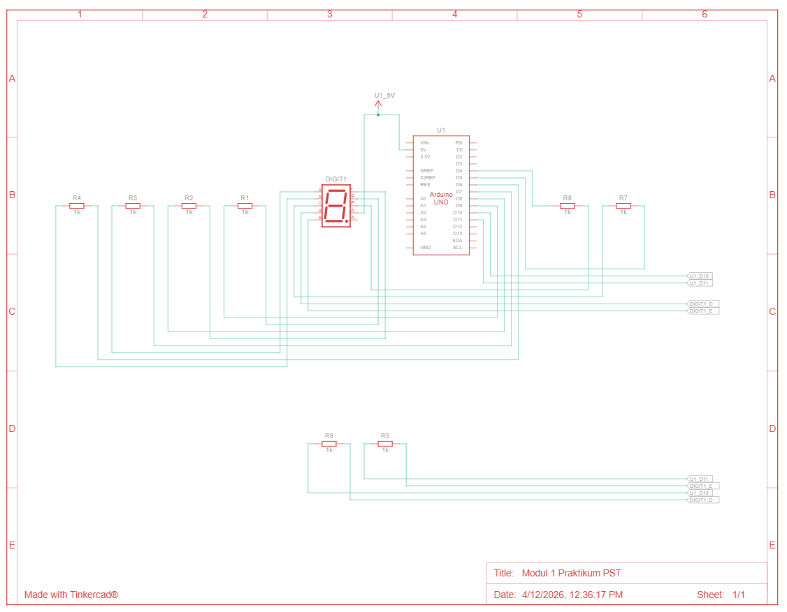

# Praktikum 2A: Seven Segment Display - Counter 0 sampai F

## Jawaban Pertanyaan Praktikum (2.5.4)

---

### 1. Schematic Rangkaian



Keterangan:
- Setiap segmen dihubungkan melalui resistor 220 Ohm untuk membatasi arus.
- Pin COM seven segment dihubungkan ke 5V karena menggunakan tipe Common Anode.
- Segmen aktif ketika pin Arduino memberikan logika LOW (0V), sehingga ada beda potensial antara COM (5V) dan pin segmen (0V).

---

### 2. Apa yang Terjadi Jika Nilai `num` Lebih dari 15?

Pada kode berikut:

```cpp
byte digitPattern[16][8] = { ... };

void displayDigit(int num){
  for(int i=0;i<8;i++){
    digitalWrite(segmentPins[i], !digitPattern[num][i]);
  }
}
```

Array `digitPattern` hanya memiliki indeks 0 sampai 15 (total 16 elemen). Jika `num` bernilai lebih dari 15, maka program akan mengakses memori di luar batas array tersebut. Ini disebut **out-of-bounds array access**.

Akibatnya:
- Program membaca nilai acak dari memori yang bukan bagian dari array (undefined behavior).
- Seven segment dapat menampilkan pola yang tidak terduga atau tidak bermakna.
- Dalam beberapa kasus, hal ini dapat menyebabkan program berperilaku tidak stabil atau crash.

Pada loop utama, program sudah dibatasi dengan `i < 16` sehingga nilai `num` tidak pernah melebihi 15 dalam kondisi normal:

```cpp
void loop() {
  for(int i=0;i<16;i++){   // i hanya dari 0 sampai 15
    displayDigit(i);
    delay(1000);
  }
}
```

---

### 3. Common Cathode atau Common Anode?

Program ini menggunakan **Common Anode**.

**Penjelasan:**

Pada fungsi `displayDigit`, nilai dari array `digitPattern` dibalik menggunakan operator NOT (`!`) sebelum dikirim ke pin:

```cpp
digitalWrite(segmentPins[i], !digitPattern[num][i]);
```

Perhatikan pola untuk digit `0` dalam array:

```cpp
{1,1,1,1,1,1,0,0}  // a=1, b=1, c=1, d=1, e=1, f=1, g=0, dp=0
```

Nilai 1 pada array berarti segmen tersebut "seharusnya menyala". Namun karena ada operator `!`, nilai yang dikirim ke pin menjadi:
- Segmen yang menyala (nilai 1 dalam array) -> dikirim `LOW` (0V) ke pin Arduino
- Segmen yang mati (nilai 0 dalam array) -> dikirim `HIGH` (5V) ke pin Arduino

Pada **Common Anode**, pin COM terhubung ke VCC (5V). Agar LED menyala, pin segmen harus diberi `LOW` supaya arus mengalir dari COM menuju pin segmen. Ini sesuai dengan logika di atas, yaitu segmen aktif ketika pin Arduino bernilai `LOW`.

Seandainya menggunakan Common Cathode, segmen akan menyala ketika pin Arduino bernilai `HIGH`, dan operator `!` tidak diperlukan (atau justru akan membuat tampilan terbalik).

---

### 4. Modifikasi Program: Tampilan Berjalan dari F ke 0

Berikut adalah modifikasi program agar counter berjalan mundur dari F (15) ke 0, beserta penjelasan setiap baris kode:

```cpp
#include <Arduino.h>
// Menyertakan library Arduino agar fungsi-fungsi seperti pinMode,
// digitalWrite, dan delay dapat digunakan.

// Mendefinisikan pin Arduino yang terhubung ke setiap segmen seven segment.
// Urutan: a, b, c, d, e, f, g, dp
const int segmentPins[8] = {7, 6, 5, 11, 10, 8, 9, 4};

// Pola bit untuk setiap karakter hex 0-F.
// Setiap baris mewakili satu karakter, dengan urutan kolom: a b c d e f g dp
// Nilai 1 = segmen aktif (menyala), 0 = segmen tidak aktif (mati).
byte digitPattern[16][8] = {
  {1,1,1,1,1,1,0,0},  // 0: segmen a,b,c,d,e,f menyala
  {0,1,1,0,0,0,0,0},  // 1: segmen b,c menyala
  {1,1,0,1,1,0,1,0},  // 2: segmen a,b,d,e,g menyala
  {1,1,1,1,0,0,1,0},  // 3: segmen a,b,c,d,g menyala
  {0,1,1,0,0,1,1,0},  // 4: segmen b,c,f,g menyala
  {1,0,1,1,0,1,1,0},  // 5: segmen a,c,d,f,g menyala
  {1,0,1,1,1,1,1,0},  // 6: segmen a,c,d,e,f,g menyala
  {1,1,1,0,0,0,0,0},  // 7: segmen a,b,c menyala
  {1,1,1,1,1,1,1,0},  // 8: semua segmen menyala
  {1,1,1,1,0,1,1,0},  // 9: segmen a,b,c,d,f,g menyala
  {1,1,1,0,1,1,1,0},  // A: segmen a,b,c,e,f,g menyala
  {0,0,1,1,1,1,1,0},  // b: segmen c,d,e,f,g menyala
  {1,0,0,1,1,1,0,0},  // C: segmen a,d,e,f menyala
  {0,1,1,1,1,0,1,0},  // d: segmen b,c,d,e,g menyala
  {1,0,0,1,1,1,1,0},  // E: segmen a,d,e,f,g menyala
  {1,0,0,0,1,1,1,0}   // F: segmen a,e,f,g menyala
};

// Fungsi untuk menampilkan satu karakter pada seven segment.
// Parameter num adalah indeks karakter (0-15) yang ingin ditampilkan.
void displayDigit(int num){
  for(int i=0; i<8; i++){
    // Operator ! membalik nilai karena seven segment menggunakan Common Anode:
    // - Nilai 1 (menyala) di array -> dikirim LOW ke pin -> segmen menyala
    // - Nilai 0 (mati) di array   -> dikirim HIGH ke pin -> segmen mati
    digitalWrite(segmentPins[i], !digitPattern[num][i]);
  }
}

// Fungsi setup dijalankan sekali saat Arduino pertama dinyalakan.
void setup() {
  // Mengatur semua pin segmen sebagai OUTPUT agar dapat mengirim sinyal digital.
  for(int i=0; i<8; i++){
    pinMode(segmentPins[i], OUTPUT);
  }
}

// Fungsi loop dijalankan berulang terus-menerus selama Arduino menyala.
void loop() {
  // Loop dari 15 (F) turun sampai 0, kemudian mengulang kembali dari F.
  for(int i=15; i>=0; i--){
    // Tampilkan digit sesuai nilai i saat ini.
    displayDigit(i);

    // Tahan tampilan selama 1000 milidetik (1 detik) sebelum berpindah ke digit berikutnya.
    delay(1000);
  }
  // Setelah mencapai 0, loop utama akan memanggil loop() lagi,
  // sehingga hitungan mundur dimulai ulang dari F secara otomatis.
}
```

**Perubahan utama dari program asli:**

Program asli menggunakan `for(int i=0; i<16; i++)` sehingga counter naik dari 0 ke F. Modifikasi mengubah loop menjadi `for(int i=15; i>=0; i--)` agar counter turun dari F (indeks 15) ke 0 (indeks 0). Logika `displayDigit` dan seluruh bagian lainnya tidak perlu diubah.
